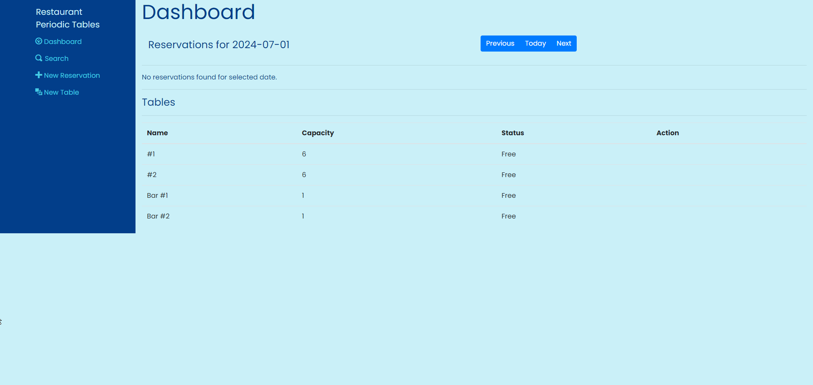
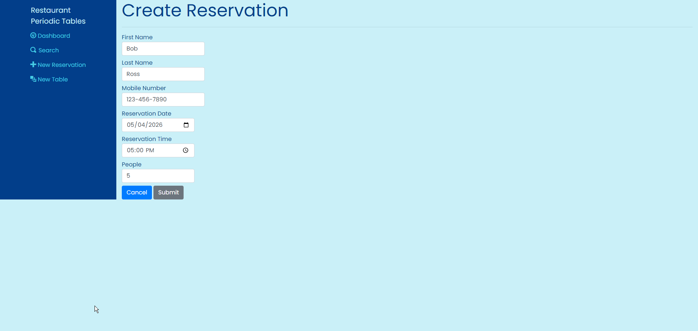

# Restaurant Reservation App

## What is it?
This is a restaurant reservation app that will allow restaurant workers to create, seat and finish a reservation.  Workers are also allowed to edit & delete reservations.  

## Technology Used
Javascript is the main software development language used for both front-end and back-end implementations. The following tools and technology have also been used to create this app. 

### Front-End
- React
- Bootstrap
- CSS & HTML

### Back-End
- Node 
- Express 
- Knex PostgreSQL API 

## Screen Samples
In place of visiting the app, screenshots have been included to showcase functionality.

### Main Dashboard
Home page of the reservation system.

### Dashboard with Reservation
1 reservation loaded on the dashboard.

### Create Reservation
Completed reservation entry.

### Search Reservation
Submitted search that succesfully returned previously created reservations based on the phone number. 

### Create Table
Table entry on the create table page.

## API Documentation

### Reservations
<!--- 
- list 
- create
- read
- update
- updateStatus
- destroy
--->
Attibute | Definition
---|---
Rest Method | reservations/
Method | Get
Description | Returns a list of reservations associated with a given date or mobile number.
Parameters | Reservation Date, or Mobile Number query parameters
&nbsp; | &nbsp;
Rest Method | reservations/
Method | Post
Description | Accepts all attributes required to create a new reservation
Properties | First Name, Last Name, Mobile Number, Reservation Date, Reservation Time, People
&nbsp; | &nbsp;
Rest Method | reservations/:reservationId
Method | Get
Description | Returns a matching reservation record given the reservation id parameter.  In addition to all columns, the following 2 derived values are also returned: formatted_date 'YYYY-MM-DD'; formatted_time 'HH12:MIPM', based on reservation date and time.
Parameter | Reservation Id
&nbsp; | &nbsp;
Rest Method | reservations/:reservationId
Method | Delete
Description | Removes a reservation record from the reservations table.
Parameter | Reservation Id
&nbsp; | &nbsp;
Rest Method | reservations/:reservationId
Method | Put
Description | Updates a reservation record in the reservations table.  
Parameters | Reservation Id
Properties | First Name, Last Name, Mobile Number, Reservation Date, Reservation Time, People
&nbsp; | &nbsp;
Rest Method | reservations/:reservationId/status
Method | Put
Description | Updates the status of a reservation in the database.
Parameters | Reservation Id
Properties | Status
 

### Tables
<!--- 
- list
- create
- read
- update
- fillSeat
- deleteSeat
- destroy 
--->
Attibute | Definition
---|---
Rest Method | tables/
Method | Get
Description | Returns a list of tables with optional reservations when a match is found on reservation_id and date. In addition to all columns from tables and optionally reservations, the following 2 derived values are also returned: formatted_date 'YYYY-MM-DD'; formatted_time 'HH12:MIPM' based on reservation date and time.
Parameters | Date
&nbsp; | &nbsp;
Rest Method | tables/
Method | Post
Description | Accepts all attributes required to create a new table record
Properties | Table name and capacity
&nbsp; | &nbsp;
Rest Method | tables/:tableId
Method | Post
Description | Accepts all attributes required to update an existing table record.
Parameters | Table Id
Properties | Table name and capacity
&nbsp; | &nbsp;
Rest Method | tables/:tableid
Method | Get
Description | Returns a matching table record given the table id parameter.  
Parameter | Table Id
&nbsp; | &nbsp;
Rest Method | tables/:tableId
Method | Delete
Description | Removes a table record from the tables table.
Parameter | Table Id
&nbsp; | &nbsp;
Rest Method | tables/:tableId
Method | Put
Description | Updates a reservation record in the reservations table.  
Parameters | Reservation Id
Properties | First Name, Last Name, Mobile Number, Reservation Date, Reservation Time, People
&nbsp; | &nbsp;
Rest Method | tables/:tableId/FillSeat
Method | Put
Description | Updates a tables record with a reservation id, and also sets the 'seated' status in matching reservation record.
Parameters | Table Id
Properties | Reservation Id
&nbsp; | &nbsp;
Rest Method | tables/:tableId/DeleteSeat
Method | Put
Description | Removes the reservation id from the matching table record, and also sets the 'finished' or 'canceled' status to matching reservation record. The 'finished' status is set by default when not defined as property.
Parameters | Table Id
Properties | Status

